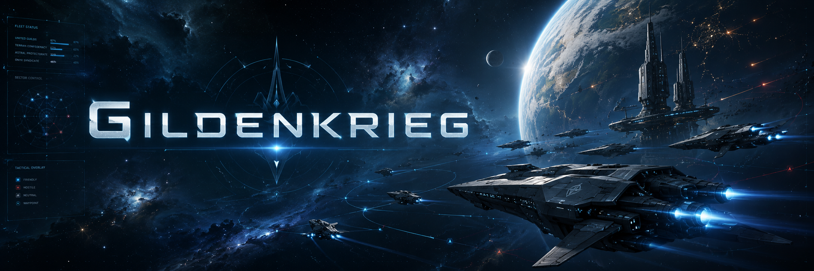

# Armen Deroian

## About Me

I am a **systems and software engineer** and a Computer Science student at **NJIT**, graduating in 2027. I build performance-sensitive software across game technology, network servers, physics simulation, procedural generation, and developer tooling.

- Building **[Gildenkrieg](https://github.com/Gildenkrieg)**, a player-driven online space game supported by custom networking, physics, simulation, and Unreal Engine infrastructure.
- Interested in data-oriented design, low-level programming, networked systems, game engine development, game programming, and scalable server architecture.
- Exploring performant physics engines, game server architecture, network replication, and procedural generation.
- Mentoring students through **FIRST Robotics** and contributing to campus communities at NJIT.
- Read more about my work at **[https://www.armenderoian.dev/](https://www.armenderoian.dev/blog)**.

## Languages & Tools

  
  
  
  
  
  
  

  
  
  
  
  
  
  
  

## Featured Work

### Gildenkrieg

 

My current flagship project is a player-driven online space game and the systems stack behind it. The project spans custom C/C++ libraries, authoritative multiplayer simulation, physics, entity synchronization, procedural planets, dedicated server infrastructure, and an Unreal Engine client. 

Discover more at **[gildenkrieg.space](https://www.gildenkrieg.space)**.

  
  

  
  

  
  

| Project | What it explores |
| --- | --- |
| **[Stratos](https://github.com/aderoian/Stratos)** | Experimental C++ Minecraft server software focused on networking and a clean plugin API. |
| **[Noise Playground](https://github.com/aderoian/noise-playground)** | Live-tunable OpenSimplex2, fractal, rigid, and Worley noise rendered with Three.js, WebGL2, and GLSL. |
| **[Box Physics](https://github.com/aderoian/box-physics)** | A small educational physics engine in C covering gravity, AABB collision detection, and collision response. |
| **[IT466Project](https://github.com/aderoian/IT466Project)** | A 3D game engine and simple space-game built from scratch during a semester college course. |
| **[IT366Project](https://github.com/aderoian/IT366-Project)** | A 2D game engine and multiplayer top-down tower defense game built from scratch. |
| **[Oritech](https://github.com/rearth/Oritech)** | Contributed to a popular Minecraft: Java Edition tech mod. |

## GitHub Contributions Summary

  
  

  

### Build the systems that make ambitious worlds possible.

